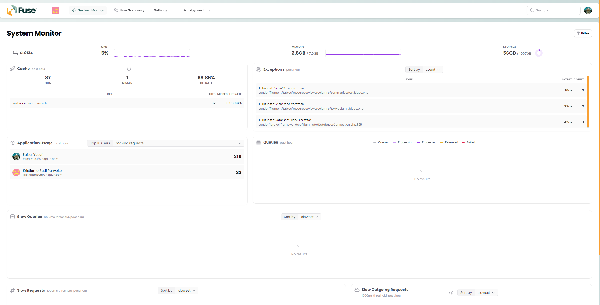
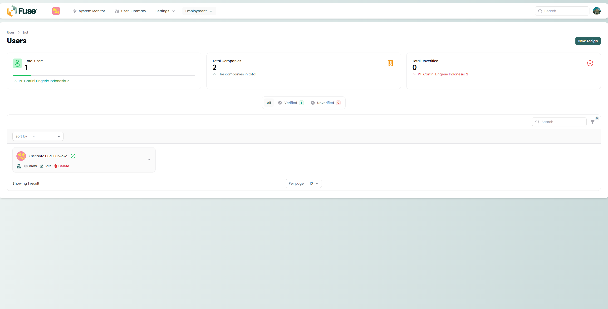

# FUSE


This is package Multi-Tenancy, User and Employee Management for Teresa.
<div class="filament-hidden">



</div>

<!-- ## Installation

You can install the package via composer:

```bash
composer require :vendor_slug/:package_slug
```

You can publish and run the migrations with:

```bash
php artisan vendor:publish --tag=":package_slug-migrations"
php artisan migrate
```

You can publish the config file with:

```bash
php artisan vendor:publish --tag=":package_slug-config"
```

This is the contents of the published config file:

```php
return [
];
```

Optionally, you can publish the views using

```bash
php artisan vendor:publish --tag=":package_slug-views"
```

## Usage

```php
$variable = new VendorName\Skeleton();
echo $variable->echoPhrase('Hello, VendorName!');
```

## Testing

```bash
composer test
``` -->

## Changelog

Please see [CHANGELOG](CHANGELOG.md) for more information on what has changed recently.

## Contributing

Please see [CONTRIBUTING](CONTRIBUTING.md) for details.

## Security Vulnerabilities

Please review [our security policy](../../security/policy) on how to report security vulnerabilities.

## Credits

- [Faisal Yusuf](https://github.com/:author_username)
- [All Contributors](../../contributors)

## License

The MIT License (MIT). Please see [License File](LICENSE.md) for more information.
